# MCP Host RPC Bridge

A Node.js library that bridges MCP (Model Context Protocol) tool calls to JSON-RPC function calls over Unix socket connections. Provides context-based scoping with JWT authentication for secure, multi-tenant MCP server deployments.

## Features

- 🚀 **Simplified Host API**: Easy-to-use module for setting up RPC servers
- 🔐 **Context-Based Scoping**: JWT-secured context passing for user/tenant scoping
- 🔌 **Unix Socket Transport**: Reliable Unix domain socket communication
- 🛡️ **Built-in Authentication**: Secure JWT-based authentication with automatic verification
- 🔧 **Dynamic Tool Registration**: Register RPC functions even after server starts
- 🎯 **Flexible Tool Sets**: Different tool subsets per MCP server instance
- 📝 **TypeScript Support**: Full TypeScript definitions included

## Installation

```bash
npm install @botanicastudios/mcp-host-rpc
```

## Quick Start

### Context-Based RPC Functions

```javascript
import { createMcpHost } from '@botanicastudios/mcp-host-rpc/host';

// Create and auto-start a host with a signing key
const host = createMcpHost({ 
  authToken: 'your-secret-key', // Used for JWT signing/verification
  start: true,                  // Auto-start the server
  debug: true 
});

// Register tools that receive verified context (can be called after start)
host.registerTool('read-user-file', {
  title: 'Read User File',
  description: 'Read a file scoped to the user',
  functionName: 'readUserFile',
  inputSchema: {
    type: 'object',
    properties: {
      filename: { type: 'string', description: 'File to read' }
    },
    required: ['filename'],
    additionalProperties: false
  }
}, async (context, args) => {
  // context = { userId: '123', permissions: ['read'] } (extracted from verified JWT)
  const userDir = `/users/${context.userId}`;
  const filePath = `${userDir}/${args.filename}`;
  
  if (!context.permissions.includes('read')) {
    throw new Error('Insufficient permissions');
  }
  
  return { content: fs.readFileSync(filePath, 'utf8') };
});
```

### Creating MCP Server Configurations

```javascript
// Create different MCP server configs for different contexts
const adminTools = ['read-user-file', 'write-user-file', 'admin-tools'];
const userTools = ['read-user-file'];

// Admin server config with admin context
const adminConfig = host.getMCPServerConfig('admin-server', adminTools, {
  userId: 'admin',
  role: 'admin',
  permissions: ['read', 'write', 'admin']
});

// User server config with limited context  
const userConfig = host.getMCPServerConfig('user-server', userTools, {
  userId: '123',
  role: 'user', 
  permissions: ['read']
});

console.log('Admin MCP Config:', JSON.stringify(adminConfig, null, 2));
// Output ready for claude_desktop_config.json:
// {
//   "admin-server": {
//     "type": "stdio",
//     "command": "npx -y @botanicastudios/mcp-host-rpc",
//     "args": [],
//     "env": {
//       "CONTEXT_TOKEN": "eyJhbGciOiJIUzI1NiIsInR5cCI6IkpXVCJ9...",
//       "PIPE": "/tmp/mcp-pipe-12345.sock",
//       "TOOLS": "{\"read-user-file\":{...}}"
//     }
//   }
// }
```

## Host Module API

### `createMcpHost(options?)`

Creates a new MCP host instance.

**Options:**
- `authToken?: string` - Secret key for JWT signing/verification (auto-generated if not provided)
- `pipePath?: string` - Custom Unix socket path (auto-generated if not provided)  
- `start?: boolean` - Auto-start the server immediately (default: false)
- `debug?: boolean` - Enable debug logging (default: false)

### `host.registerTool(toolName, properties, handler)`

Register an RPC tool with context-based handler. Can be called before or after server starts.

**Parameters:**
- `toolName: string` - Tool name (used in MCP tool configurations)
- `properties: object` - Tool configuration object
  - `title: string` - Human-readable title for the tool
  - `description: string` - Description of what the tool does
  - `functionName: string` - RPC function name for internal routing
  - `inputSchema: object` - JSON Schema object for tool inputs
- `handler: (context, args) => Promise<any>` - Function that handles the RPC call

```javascript
host.registerTool('echo', {
  title: 'Echo Message',
  description: 'Echo a message with user context',
  functionName: 'echoHandler',
  inputSchema: {
    type: 'object',
    properties: {
      message: { type: 'string', description: 'Message to echo' }
    },
    required: ['message'],
    additionalProperties: false
  }
}, async (context, args) => {
  // context = verified JWT payload.context
  return { 
    echo: args.message, 
    user: context.userId,
    timestamp: new Date().toISOString() 
  };
});
```

### `host.getMCPServerEnvVars(tools, context)`

Get environment variables for an MCP server instance.

```javascript
const envVars = host.getMCPServerEnvVars(
  ['read-file', 'write-file'],           // Tool subset
  { userId: '123', permissions: ['read'] } // Context to embed in JWT
);
// Returns: { CONTEXT_TOKEN: "jwt...", PIPE: "/tmp/...", TOOLS: "..." }
```

### `host.getMCPServerConfig(name, tools, context)`

Get complete MCP client configuration ready for `claude_desktop_config.json`.

```javascript
const config = host.getMCPServerConfig(
  'my-app-server',                      // Server name
  ['read-file', 'write-file'],          // Tool subset  
  { userId: '123', permissions: ['read'] } // Context to embed in JWT
);
// Returns full MCP client config object
```

### `host.start()` and `host.stop()`

Manually start/stop the server (only needed if `start: false` in options).

```javascript
const host = createMcpHost({ start: false });
// Register tools...
await host.start(); // Manual start
await host.stop();  // Graceful shutdown
```

## Complete Example

```javascript
import { createMcpHost } from '@botanicastudios/mcp-host-rpc/host';
import * as fs from 'fs';
import * as path from 'path';

// Create and auto-start host
const host = createMcpHost({ 
  authToken: 'my-secret-signing-key',
  start: true,
  debug: true 
});

// Register context-aware file operations
host.registerTool('read-file', {
  title: 'Read File',
  description: 'Read file contents scoped to user',
  functionName: 'readFile',
  inputSchema: {
    type: 'object',
    properties: {
      path: { type: 'string', description: 'File path' }
    },
    required: ['path'],
    additionalProperties: false
  }
}, async (context, args) => {
  // Scope file access to user directory
  const userDir = `/users/${context.userId}`;
  const safePath = path.join(userDir, args.path);
  
  if (!context.permissions.includes('read')) {
    throw new Error('Insufficient permissions');
  }

  try {
    const content = fs.readFileSync(safePath, 'utf8');
    return { success: true, content, path: args.path };
  } catch (error) {
    return { success: false, error: error.message };
  }
});

host.registerTool('echo', {
  title: 'Echo',
  description: 'Echo a message with user context',
  functionName: 'echo',
  inputSchema: {
    type: 'object',
    properties: {
      message: { type: 'string', description: 'Message to echo' }
    },
    required: ['message'],
    additionalProperties: false
  }
}, async (context, args) => {
  return { 
    echo: args.message, 
    user: context.userId,
    timestamp: new Date().toISOString() 
  };
});

// Create MCP server configs for different users/contexts
const configs = {
  admin: host.getMCPServerConfig('admin', ['read-file', 'echo'], {
    userId: 'admin',
    role: 'admin', 
    permissions: ['read', 'write', 'admin']
  }),
  
  user123: host.getMCPServerConfig('user123', ['read-file', 'echo'], {
    userId: '123',
    role: 'user',
    permissions: ['read']
  })
};

console.log('MCP Configs for claude_desktop_config.json:');
console.log(JSON.stringify(configs, null, 2));

// Graceful shutdown
process.on('SIGINT', async () => {
  await host.stop();
  process.exit(0);
});
```

## How It Works

1. **Host Setup**: Create an MCP host with a secret signing key and optionally auto-start
2. **Tool Registration**: Register context-aware RPC tools (before or after start)
3. **Context Generation**: Generate MCP server configs with JWT-signed context tokens
4. **MCP Bridge**: Each MCP server instance connects with its own context token
5. **Function Execution**: Handlers receive verified context extracted from JWT for scoping
6. **Response Handling**: Results are automatically formatted and returned to the MCP client

## Architecture Flow

```mermaid
sequenceDiagram
    participant Host as Host Process<br/>(Your App)
    participant Agent as Agent Process<br/>(Claude Desktop)
    participant MCP as MCP Server Process<br/>(Bridge)

    Note over Host: Setup Phase
    Host->>Host: createMcpHost({ authToken: 'secret' })
    Host->>Host: registerTool('read-file', {...}, handler)
    Host->>Host: getMCPServerConfig('user', ['read-file'], { userId: '123' })
    Note right of Host: Generates JWT with context

    Note over Agent: Configuration
    Agent->>Agent: Load claude_desktop_config.json
    Note right of Agent: Contains CONTEXT_TOKEN, PIPE, TOOLS

    Note over Host,MCP: Runtime Phase
    Agent->>MCP: Start MCP server process
    Note right of Agent: ENV: CONTEXT_TOKEN=jwt...<br/>PIPE=/tmp/socket<br/>TOOLS={"read-file":{...}}
    
    MCP->>Host: Connect via Unix socket
    Note right of MCP: Establishes RPC connection

    Agent->>MCP: Call tool: read-file({ path: "doc.txt" })
    MCP->>Host: RPC: readFile(contextToken, { path: "doc.txt" })
    Note right of Host: Verify JWT → extract context<br/>context = { userId: '123' }
    
    Host->>Host: handler(context, args)
    Note right of Host: Scoped file access:<br/>/users/123/doc.txt
    
    Host-->>MCP: Return: { content: "file data" }
    MCP-->>Agent: MCP response: [{ type: "text", text: "file data" }]
```



## Context-Based Security

The library uses JWT tokens to securely pass context from MCP servers to RPC handlers:

```javascript
// When creating MCP server config
const context = { userId: '123', permissions: ['read'] };
const jwt = sign({ context }, authToken); // Signed with host's authToken

// In RPC handler
async (context, args) => {
  // context is automatically verified and extracted from JWT
  // context = { userId: '123', permissions: ['read'] }
}
```

## Environment Variables

Each MCP server instance receives these environment variables:

- `CONTEXT_TOKEN`: JWT containing signed context data
- `PIPE`: Unix socket path for RPC communication  
- `TOOLS`: JSON configuration of available tools

## Multiple MCP Server Instances

You can create multiple MCP server instances from one host, each with different tool sets and contexts:

```javascript
// Different contexts for different use cases
const configs = {
  // Admin with full access
  admin: host.getMCPServerConfig('admin', allTools, { 
    role: 'admin', permissions: ['*'] 
  }),
  
  // Regular user with limited tools
  user: host.getMCPServerConfig('user', readOnlyTools, { 
    userId: '123', permissions: ['read'] 
  }),
  
  // Service account with specific permissions
  service: host.getMCPServerConfig('backup-service', backupTools, { 
    service: 'backup', permissions: ['read', 'backup'] 
  })
};
```

## Real-World Usage Patterns

### Multi-Tenant SaaS Application

```javascript
// Create configs for different customers
const customerConfigs = customers.map(customer => 
  host.getMCPServerConfig(`customer-${customer.id}`, customerTools, {
    customerId: customer.id,
    plan: customer.plan,
    permissions: getPermissionsForPlan(customer.plan)
  })
);
```

### Role-Based Access Control

```javascript
const roles = {
  admin: { permissions: ['read', 'write', 'admin', 'delete'] },
  editor: { permissions: ['read', 'write'] },
  viewer: { permissions: ['read'] }
};

const userConfig = host.getMCPServerConfig(`user-${userId}`, userTools, {
  userId,
  role: user.role,
  permissions: roles[user.role].permissions
});
```

### Dynamic Tool Registration

```javascript
// Start with basic tools
const host = createMcpHost({ start: true });

host.registerTool('base-tool', {
  title: 'Base Tool',
  description: 'Always available tool',
  functionName: 'baseTool',
  inputSchema: { type: 'object', properties: {}, additionalProperties: false }
}, async (context, args) => { ... });

// Add more tools later based on business logic
if (featureFlagEnabled) {
  host.registerTool('premium-tool', {
    title: 'Premium Tool', 
    description: 'Premium feature tool',
    functionName: 'premiumTool',
    inputSchema: { type: 'object', properties: {}, additionalProperties: false }
  }, async (context, args) => { ... });
}
```

## Error Handling

- Invalid JWT tokens result in RPC authentication errors
- Context verification failures are automatically handled
- Socket connection failures terminate the server gracefully
- Invalid tool configurations prevent server startup
- Permission denied errors are returned to MCP clients

## Security Features

- **JWT Authentication**: All context data is cryptographically signed
- **Automatic Verification**: Tokens are verified before handler execution  
- **Context Scoping**: Handlers receive verified context for access control
- **Non-Expiring Tokens**: JWTs don't expire (suitable for long-running MCP servers)
- **Secret Key Protection**: Signing key never leaves the host application